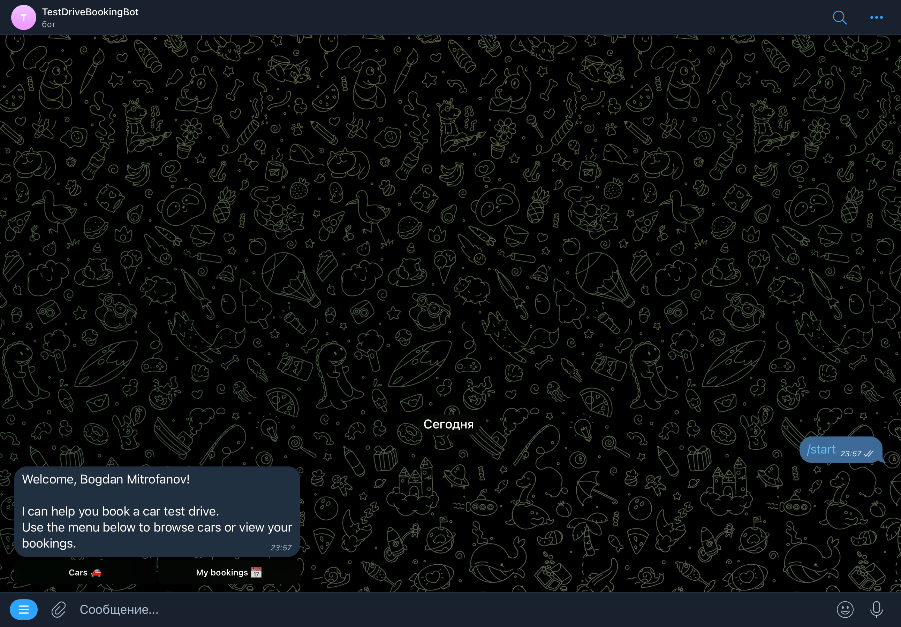
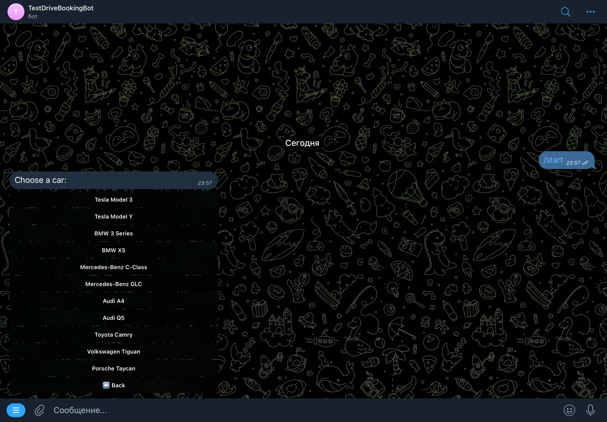
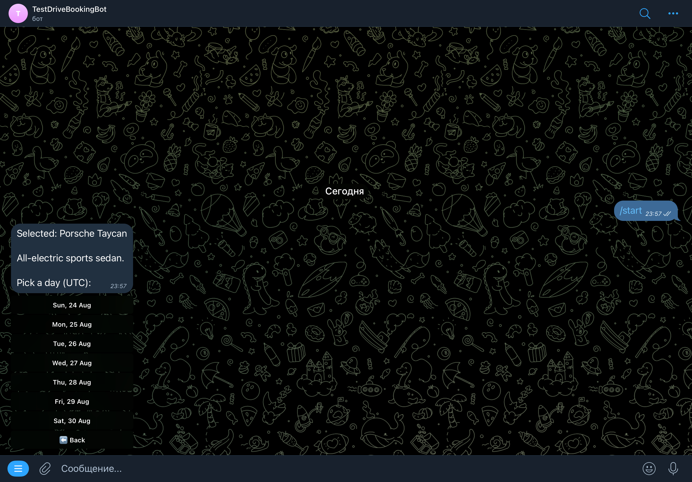
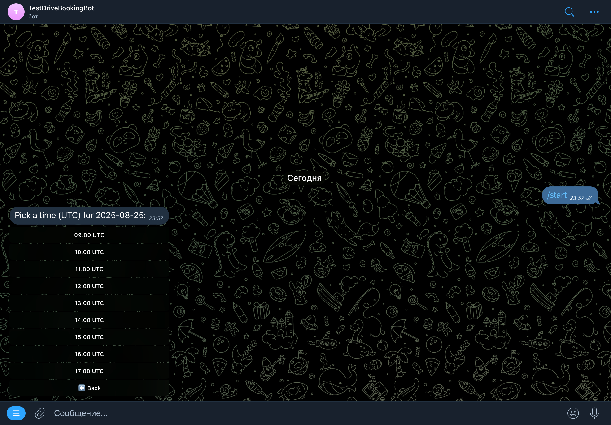
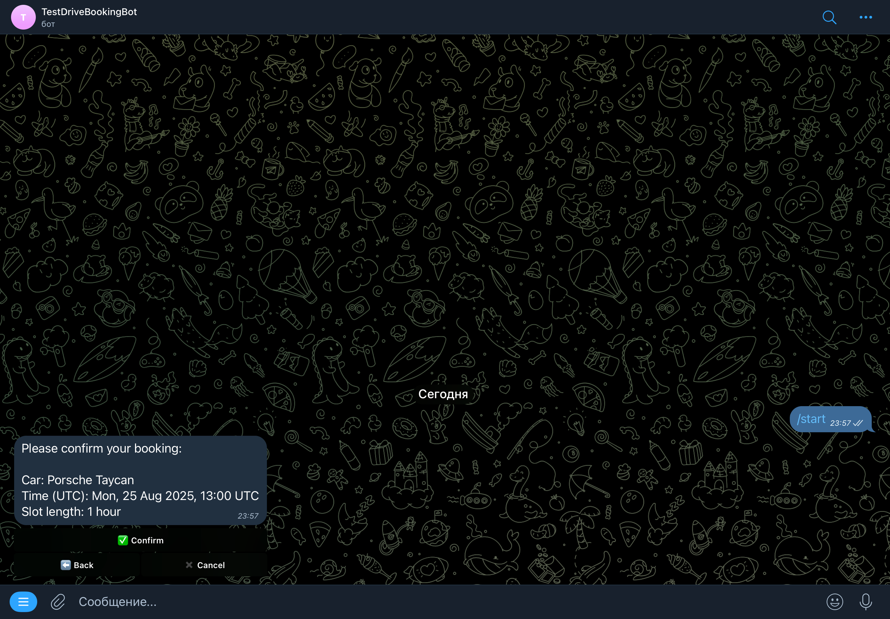
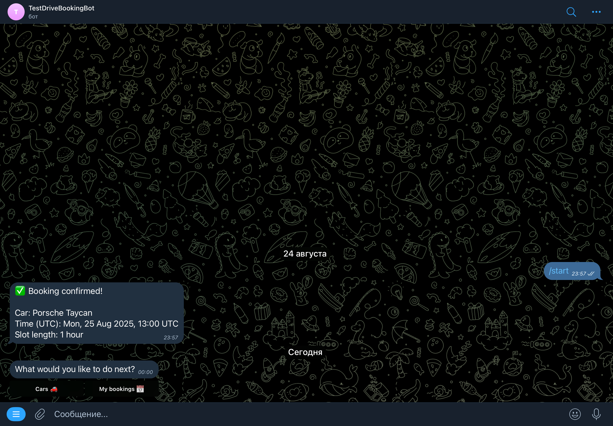
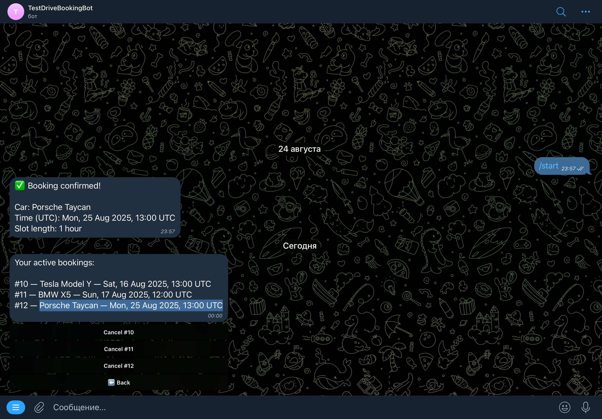

# Бот для записи на тест-драйв

Telegram-бот и REST API для администраторов, позволяющие бронировать тест-драйвы автомобилей.
Разработан на **Java 17** и **Spring Boot 3**.
Ориентирован на продакшн: чистая архитектура, использование DTO, миграции Flyway, глобальная обработка ошибок, контейнеризация Postgres в Docker и настройка через переменные окружения.

---

## Содержание

* [Возможности](#возможности)
* [Скриншоты процесса](#скриншоты-процесса)
* [Архитектура](#архитектура)
* [Технологический стек](#технологический-стек)
* [Доменная модель](#доменная-модель)
* [База данных и миграции](#база-данных-и-миграции)
* [Конфигурация](#конфигурация)
* [Запуск](#запуск)

    * [Вариант А: Всё в Docker](#вариант-а-всё-в-docker)
    * [Вариант B: БД в Docker, приложение локально](#вариант-b-бд-в-docker-приложение-локально)
* [REST API (админ)](#rest-api-админ)

    * [Аутентификация](#аутентификация)
    * [Автомобили](#автомобили)
    * [Бронирования](#бронирования)
    * [Ошибки](#ошибки)
    * [Примеры cURL](#примеры-curl)
* [Telegram-бот](#telegram-бот)
* [Команды Makefile](#команды-makefile)
* [Эксплуатационные заметки](#эксплуатационные-заметки)

    * [Логирование](#логирование)
    * [Время и часовой пояс](#время-и-часовой-пояс)
    * [Безопасность](#безопасность)
    * [Здоровье системы и отладка](#здоровье-системы-и-отладка)
    * [Резервное копирование](#резервное-копирование)

---

## Возможности

* **Telegram-бот (Long Polling)** для клиентов:

    * `/start`, `/help`, `/cars`, `/my`
    * Просмотр авто → выбор дня → выбор времени (часовые слоты **09:00–18:00 UTC**) → подтверждение записи
    * Просмотр и отмена активных бронирований

* **Админ REST API** под защитой заголовка `X-Admin-Token`:

    * Управление автомобилями (CRUD)
    * Просмотр всех записей с деталями пользователя и автомобиля; удаление бронирования

* **PostgreSQL** + **Flyway** (DDL не выполняется в рантайме)

* **UTC везде**; время слота хранится как **TIMESTAMPTZ** (`OffsetDateTime` в Java)

* **Частичный уникальный индекс** защищает от двойных бронирований `(car_id, datetime)` при `status='CONFIRMED'`

* Чистый код: DTO, транзакционные сервисы, **глобальный обработчик ошибок** с унифицированным `ApiError` JSON

* Приложение и база в Docker с healthcheck и удобным логированием

---

## Скриншоты процесса

### Приветствие



### Список авто



### Выбор дня



### Выбор времени



### Подтверждение



### Следующее действие



### Список бронирований



---

## Архитектура

```
src/main/java/io/mitrofanovbp/testdrivebot/
 ├─ config/        # Настройки: AppProperties, Jackson, CORS, Telegram, фильтр для токена админа
 ├─ controller/    # REST-контроллеры (админ)
 ├─ dto/           # DTO для I/O + ApiError
 ├─ exception/     # Кастомные исключения + GlobalExceptionHandler
 ├─ model/         # JPA-сущности (User, Car, Booking, BookingStatus)
 ├─ repository/    # Репозитории Spring Data
 ├─ service/       # Бизнес-логика (UserService, CarService, BookingService)
 └─ telegram/      # Telegram-бот (LongPolling), команды, утилиты
     ├─ commands/
     └─ utils/
```

---

## Технологический стек

* **Java 17**, **Spring Boot 3** — Web, Data JPA, Validation, Scheduling
* **PostgreSQL 16**, **Flyway**
* **Telegram Bots Java API**
* **Jackson** (JavaTime)
* **SLF4J + Logback**
* **Maven**
* **Без Lombok**

---

## Доменная модель

**Таблицы**

* `users` — пользователи Telegram (`telegram_id` уникальный)
* `cars` — каталог автомобилей (`model`, `description`)
* `bookings` — записи пользователей на тест-драйв (TIMESTAMPTZ), `status` ∈ {`CONFIRMED`, `CANCELED`}

**Связи**

* 1 пользователь → много бронирований
* 1 авто → много бронирований

**Правила**

* Слот должен быть в **будущем**
* Только начало часа (`mm:ss = 00:00`)
* Диапазон: **09:00–18:00 UTC** (включая начало, исключая конец)
* Частичный уникальный индекс запрещает 2 записи на одно авто и время, если обе **CONFIRMED**

---

## База данных и миграции

* Схемой управляет Flyway (версионированные миграции)
* `spring.jpa.hibernate.ddl-auto=validate` (генерация схемы отключена)
* `spring.jpa.open-in-view=false`

**Миграции**

* `V1__create_schema.sql` — таблицы, ключи, индексы, частичный уникальный индекс
* `V2__seed_cars.sql` — добавляет 10 авто (описания на английском, пример: Tesla Model 3, BMW 3 Series и др.)

**Имя БД по умолчанию:** `testdrive_booking_bot`

---

## Конфигурация

Управляется **переменными окружения** (см. `.env.example`).

**База данных**

* `DB_NAME`, `DB_USER`, `DB_PASSWORD`, `DB_PORT` (для Docker Compose)
* Переопределения JDBC (локально):

    * `SPRING_DATASOURCE_URL`
    * `SPRING_DATASOURCE_USERNAME`
    * `SPRING_DATASOURCE_PASSWORD`

**Приложение**

* `APP_TELEGRAM_BOT_TOKEN` — токен от BotFather
* `APP_TELEGRAM_BOT_USERNAME` — юзернейм бота (без `@`)
* `APP_ADMIN_TOKEN` — токен для заголовка `X-Admin-Token`

**Логирование**

* `LOG_FILE` — опционально, лог в файл (по умолчанию — консоль)
* Временные метки — UTC

---

## Запуск

### Вариант А: Всё в Docker

```bash
cp .env.example .env
# настроить APP_TELEGRAM_BOT_TOKEN, APP_TELEGRAM_BOT_USERNAME, APP_ADMIN_TOKEN
docker compose up -d --build
docker compose logs -f app
```

* Приложение: `http://localhost:8080`
* БД: `localhost:5432`
* Flyway выполняется при старте

### Вариант B: БД в Docker, приложение локально

```bash
docker compose up -d db
export SPRING_DATASOURCE_URL=jdbc:postgresql://localhost:5432/testdrive_booking_bot
export SPRING_DATASOURCE_USERNAME=postgres
export SPRING_DATASOURCE_PASSWORD=postgres
export APP_TELEGRAM_BOT_TOKEN=<токен>
export APP_TELEGRAM_BOT_USERNAME=<имя_бота>
export APP_ADMIN_TOKEN=<токен_админа>
mvn spring-boot:run
```

Бот работает через **Long Polling** — публичный webhook не нужен.

---

## REST API (админ)

**Базовый путь:** `/api/admin`
**Заголовок авторизации:** `X-Admin-Token: <token>`

(см. примеры в оригинале: `cars`, `bookings`, ошибки, примеры cURL)

---

## Telegram-бот

1. Создайте бота через **@BotFather** → получите токен и юзернейм
2. Запустите приложение — бот зарегистрируется и команды установятся автоматически
3. В Telegram:

    * `/start` → приветствие + меню
    * **Cars** → выбор модели → даты → времени → подтверждение
    * **My bookings** → список активных записей + кнопки отмены

---

## Команды Makefile

```bash
make up       # docker compose up -d --build (app + db)
make down     # docker compose down -v
make logs     # следить за логами приложения
make db-up    # запустить только БД
make psql     # открыть psql в контейнере
make rebuild  # пересобрать образ приложения без кеша
```

---

## Эксплуатационные заметки

### Логирование

* Лог — построчно, метки времени в **UTC**
* Можно писать в файл через `LOG_FILE`

### Время и часовой пояс

* Всё работает в **UTC**
* Проверки: слот в будущем, начало часа, диапазон 09:00–18:00

### Безопасность

* Админ API защищён `X-Admin-Token`
* Не коммитить реальные токены, использовать `.env`
* Секреты не логируются

### Здоровье системы и отладка

* У БД есть healthcheck (`docker compose ps` → статус healthy)
* Если Flyway падает — проверить соединение и историю схемы
* Если бот не отвечает: проверить токен/юзернейм и что не запущено 2 экземпляра

### Резервное копирование

* Данные в Docker volume `pgdata`
* Backup:

  ```bash
  docker compose exec -e PGPASSWORD=$DB_PASSWORD db \
    pg_dump -U $DB_USER -d $DB_NAME > backup.sql
  ```
* Восстановление:

  ```bash
  docker compose exec -e PGPASSWORD=$DB_PASSWORD -T db \
    psql -U $DB_USER -d $DB_NAME < backup.sql
  ```