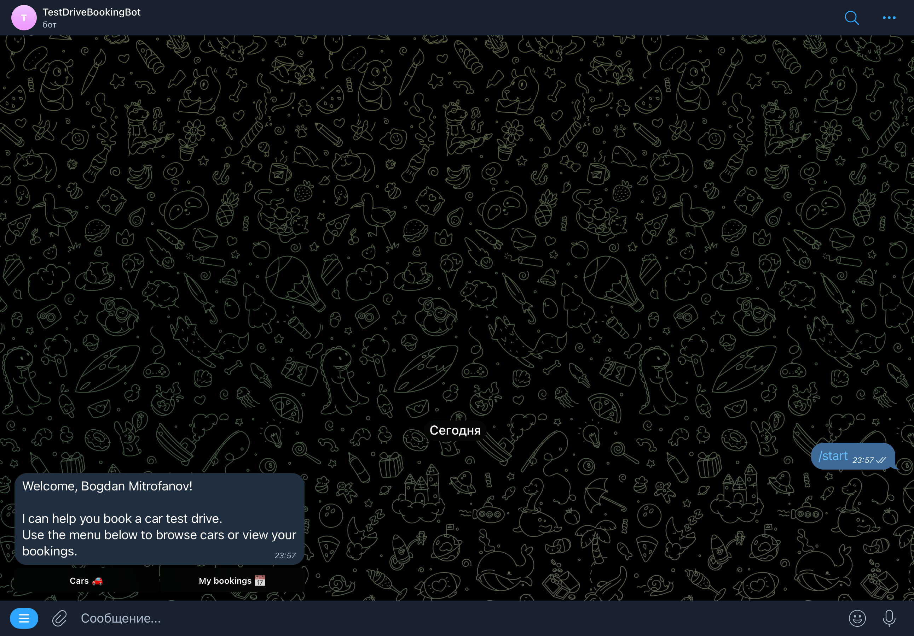
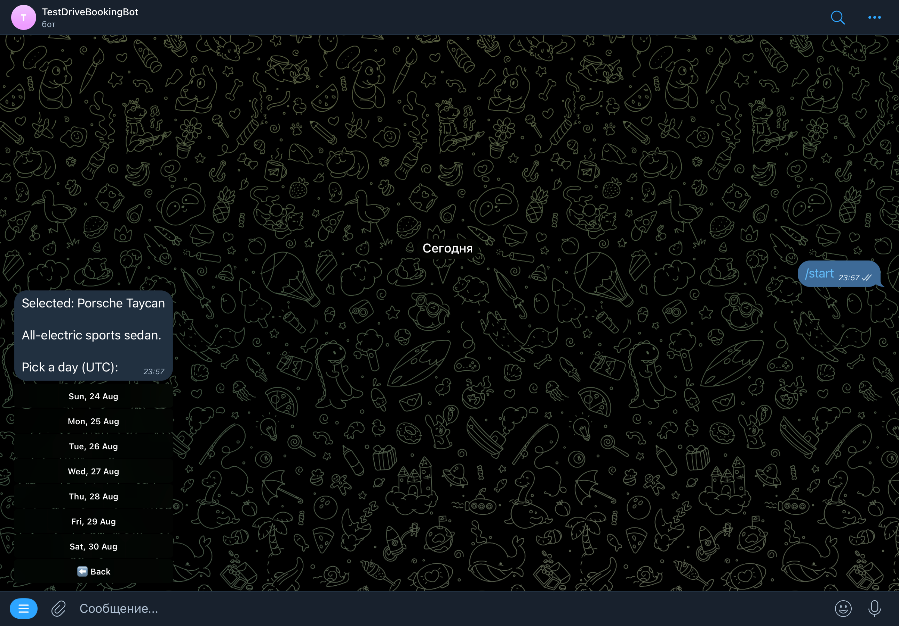
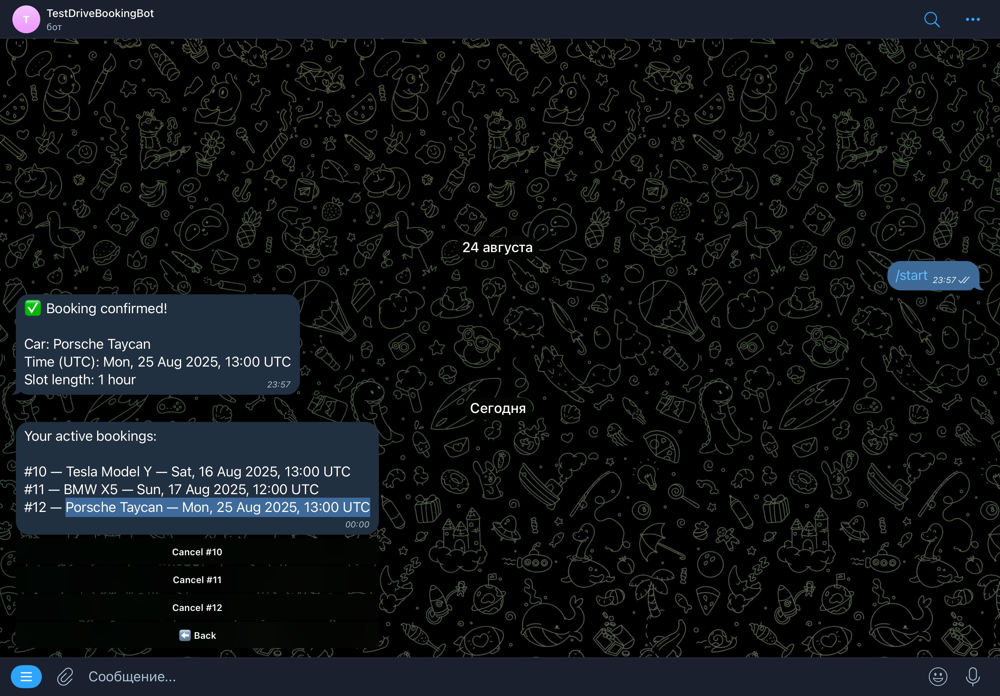

# Test Drive Booking Bot

Telegram bot + Admin REST API for booking car test drives. Built with **Java 17** and **Spring Boot 3**.
Production-minded: clean architecture, DTOs, Flyway migrations, global exception handling, Dockerized Postgres, and environment-driven config.


---

## Table of Contents

* [Features](#features)
* [Workflow screenshots](#workflow-screenshots)
* [Architecture](#architecture)
* [Tech Stack](#tech-stack)
* [Domain Model](#domain-model)
* [Database & Migrations](#database--migrations)
* [Configuration](#configuration)
* [Running](#running)

  * [Path A: Everything in Docker](#path-a-everything-in-docker)
  * [Path B: DB in Docker, App locally](#path-b-db-in-docker-app-locally)
* [REST API (Admin)](#rest-api-admin)

  * [Authentication](#authentication)
  * [Cars](#cars)
  * [Bookings](#bookings)
  * [Errors](#errors)
  * [cURL Examples](#curl-examples)
* [Telegram Bot](#telegram-bot)
* [Makefile Shortcuts](#makefile-shortcuts)
* [Operational Notes](#operational-notes)

  * [Logging](#logging)
  * [Time & Timezone](#time--timezone)
  * [Security](#security)
  * [Health & Troubleshooting](#health--troubleshooting)
  * [Backups](#backups)
---

## Features

* **Telegram Long Polling bot** for customers:

  * `/start`, `/help`, `/cars`, `/my`
  * Browse cars → pick day → pick time (hourly slots **09:00–18:00 UTC**), confirm booking
  * List active bookings and cancel them
* **Admin REST API** protected by header `X-Admin-Token`:

  * Manage cars (CRUD)
  * List all bookings with expanded user & car info; delete booking
* **PostgreSQL** with **Flyway** (no runtime DDL)
* **UTC everywhere**; booking slot stored as **TIMESTAMPTZ** (Java uses `OffsetDateTime`)
* **Partial unique index** prevents double-booking per `(car_id, datetime)` for `status='CONFIRMED'`
* Clean code: DTOs, transactional services, and a **global exception handler** returning unified `ApiError` JSON
* Dockerized app & DB with healthcheck and pragmatic logging

---

## Workflow screenshots
### Welcome message


### Cars list


### Choose day


### Choose time


### Confirm booking


### Next action


### Booking list


---

## Architecture

```
src/main/java/io/mitrofanovbp/testdrivebot/
 ├─ config/        # AppProperties, Jackson config, CORS, Telegram registration, Admin token filter
 ├─ controller/    # REST controllers (admin)
 ├─ dto/           # DTOs for I/O + ApiError
 ├─ exception/     # Custom exceptions + GlobalExceptionHandler
 ├─ model/         # JPA entities (User, Car, Booking, BookingStatus)
 ├─ repository/    # Spring Data repositories
 ├─ service/       # Business services (UserService, CarService, BookingService)
 └─ telegram/      # Telegram bot (LongPolling), commands, utils
     ├─ commands/
     └─ utils/
```

---

## Tech Stack

* **Java 17**, **Spring Boot 3** — Web, Data JPA, Validation, Scheduling
* **PostgreSQL 16**, **Flyway**
* **Telegram Bots Java API**
* **Jackson** (JavaTime)
* **SLF4J + Logback**
* **Maven**
* **No Lombok**

---

## Domain Model

**Tables**

* `users` — Telegram users (`telegram_id` unique)
* `cars` — car catalog (`model`, `description`)
* `bookings` — booking of a car by a user at a specific datetime (TIMESTAMPTZ), `status` ∈ {`CONFIRMED`, `CANCELED`}

**Relationships**

* 1 user → many bookings
* 1 car → many bookings

**Business rules**

* Slot must be **future**
* Slot must be **top-of-the-hour** (`mm:ss = 00:00`)
* Slot must be within **09:00–18:00 UTC** (inclusive start, exclusive end)
* Partial unique index forbids two **confirmed** bookings for the same `(car, datetime)`

---

## Database & Migrations

* Flyway manages schema with versioned migrations.
* `spring.jpa.hibernate.ddl-auto=validate` (no schema generation at runtime).
* `spring.jpa.open-in-view=false`.

**Migrations**

* `V1__create_schema.sql` — tables, FKs, indexes, partial unique index:

  ```sql
  CREATE UNIQUE INDEX uq_booking_car_slot_confirmed
    ON bookings (car_id, datetime)
    WHERE status = 'CONFIRMED';
  ```
* `V2__seed_cars.sql` — seeds 10 cars (English descriptions):

  * Tesla Model 3 — “Electric sedan with up to 602 km range and excellent dynamics.”
  * Tesla Model Y — “Compact crossover with a spacious cabin and Autopilot.”
  * BMW 3 Series — “Balanced comfort and driving dynamics; a classic sports sedan.”
  * BMW X5 — “Premium SUV packed with advanced technology.”
  * Mercedes-Benz C-Class — “Business-class benchmark with modern driver assists.”
  * Mercedes-Benz GLC — “SUV with a comfortable ride and high-quality interior.”
  * Audi A4 — “Precise handling, digital cockpit, and MMI system.”
  * Audi Q5 — “Popular premium crossover for city and long trips.”
  * Toyota Camry — “Reliability, efficiency, and plenty of space.”
  * Volkswagen Tiguan — “Versatile crossover with a practical interior.”

**Default DB name:** `testdrive_booking_bot`

---

## Configuration

Everything is driven by **environment variables** (see `.env.example`).

**Database**

* `DB_NAME`, `DB_USER`, `DB_PASSWORD`, `DB_PORT`
  *(used by Docker Compose for the DB container)*
* Optional JDBC override (when running locally):

  * `SPRING_DATASOURCE_URL`
  * `SPRING_DATASOURCE_USERNAME`
  * `SPRING_DATASOURCE_PASSWORD`

**Application**

* `APP_TELEGRAM_BOT_TOKEN` — BotFather token
* `APP_TELEGRAM_BOT_USERNAME` — bot handle (e.g., `test_drive_booking_bot`, **without @**)
* `APP_ADMIN_TOKEN` — token required in `X-Admin-Token` header for admin endpoints

**Logging**

* Optional `LOG_FILE` to also write logs to a file (console is default).
* Log timestamps are UTC.

> **Note:** `.env` is consumed by Docker Compose. When running from your IDE, set env vars in the Run Configuration.

---

## Running

### Path A: Everything in Docker

```bash
# 1) Prepare env
cp .env.example .env
# Edit .env: set APP_TELEGRAM_BOT_TOKEN, APP_TELEGRAM_BOT_USERNAME, APP_ADMIN_TOKEN

# 2) Build & run
docker compose up -d --build

# 3) Tail logs
docker compose logs -f app
```

* App: `http://localhost:8080`
* DB: `localhost:5432`
* Flyway runs automatically on startup.

### Path B: DB in Docker, App locally

```bash
# 1) Start only Postgres
docker compose up -d db

# 2) Export env (or configure them in your IDE Run Configuration)
export SPRING_DATASOURCE_URL=jdbc:postgresql://localhost:5432/testdrive_booking_bot
export SPRING_DATASOURCE_USERNAME=postgres
export SPRING_DATASOURCE_PASSWORD=postgres
export APP_TELEGRAM_BOT_TOKEN=<your_token>
export APP_TELEGRAM_BOT_USERNAME=<your_bot_username_without_at>
export APP_ADMIN_TOKEN=<your_admin_token>

# 3) Run the app
mvn spring-boot:run
```

> The bot uses **Long Polling** — you do not need a public webhook.

---

## REST API (Admin)

**Base path:** `/api/admin`
**Auth header:** `X-Admin-Token: <token>`

### Authentication

Invalid or missing token → `401 Unauthorized` with `ApiError` JSON:

```json
{
  "timestamp": "2025-01-01T10:00:00Z",
  "status": 401,
  "error": "Unauthorized",
  "message": "Missing or invalid X-Admin-Token",
  "path": "/api/admin/cars"
}
```

### Cars

* `GET /api/admin/cars` → list all cars → `CarDto[]`
* `GET /api/admin/cars/{id}` → get one → `CarDto`
* `POST /api/admin/cars` → create
  Body: `{"model":"...", "description":"..."}` → `CarDto`
* `PUT /api/admin/cars/{id}` → update
  Body: `{"model":"...", "description":"..."}` → `CarDto`
* `DELETE /api/admin/cars/{id}` → delete (204 No Content)

### Bookings

* `GET /api/admin/bookings` → list all with user & car expanded → `BookingAdminDto[]`
* `DELETE /api/admin/bookings/{id}` → delete booking (204 No Content)

### Errors

Unified error contract: **`ApiError`**

```json
{
  "timestamp": "2025-01-01T10:00:00Z",
  "status": 400,
  "error": "Bad Request",
  "message": "Please select a future time slot",
  "path": "/api/admin/bookings",
  "errors": ["field: reason"]
}
```

### cURL Examples

```bash
# List cars
curl -H "X-Admin-Token: $APP_ADMIN_TOKEN" \
  http://localhost:8080/api/admin/cars

# Create a car
curl -X POST -H "Content-Type: application/json" \
  -H "X-Admin-Token: $APP_ADMIN_TOKEN" \
  -d '{"model":"Porsche Taycan","description":"All-electric sports sedan."}' \
  http://localhost:8080/api/admin/cars

# Update a car (replace {id})
curl -X PUT -H "Content-Type: application/json" \
  -H "X-Admin-Token: $APP_ADMIN_TOKEN" \
  -d '{"model":"Porsche Taycan 4S","description":"AWD all-electric sports sedan."}' \
  http://localhost:8080/api/admin/cars/{id}

# Delete a car (replace {id})
curl -X DELETE -H "X-Admin-Token: $APP_ADMIN_TOKEN" \
  http://localhost:8080/api/admin/cars/{id}

# List bookings
curl -H "X-Admin-Token: $APP_ADMIN_TOKEN" \
  http://localhost:8080/api/admin/bookings

# Delete a booking (replace {id})
curl -X DELETE -H "X-Admin-Token: $APP_ADMIN_TOKEN" \
  http://localhost:8080/api/admin/bookings/{id}
```

---

## Telegram Bot

1. Create a bot via **@BotFather** and obtain:

  * Token → `APP_TELEGRAM_BOT_TOKEN`
  * Username → `APP_TELEGRAM_BOT_USERNAME` (e.g., `test_drive_booking_bot`, **without @**)
2. Start the app; the bot is registered and commands are set automatically.
3. In Telegram:

  * `/start` → friendly greeting + main menu
  * **Cars** → pick model → pick day → pick time → **Confirm**
  * **My bookings** → list active bookings + **Cancel** buttons
4. All times are **UTC**. Available slots: **09:00–18:00 UTC**, step **1 hour** (end-exclusive).

---

## Makefile Shortcuts

```bash
make up       # docker compose up -d --build (app + db)
make down     # docker compose down -v
make logs     # follow app logs
make db-up    # start only db
make psql     # open psql in the db container
make rebuild  # rebuild app image without cache
```

---

## Operational Notes

### Logging

* Line-oriented logs with **UTC** timestamps (Logback).
* Set `LOG_FILE=/var/log/app.log` to also write to a file.

### Time & Timezone

* Server & DB run in **UTC**.
* `OffsetDateTime` end-to-end; DB column is **TIMESTAMPTZ**.
* Business checks:

  * future slot only
  * top-of-the-hour
  * **09:00–18:00 UTC** (inclusive start, exclusive end)

### Security

* Admin API protected by **`X-Admin-Token`**.
* Do **not** commit real tokens or secrets; use `.env` and environment variables.
* Secrets are not logged.

### Health & Troubleshooting

* DB container has a healthcheck: `docker compose ps` should show **healthy**.
* If Flyway fails: verify DB connectivity and that the schema history is clean.
* If the bot is idle:

  * Check `APP_TELEGRAM_BOT_TOKEN` and `APP_TELEGRAM_BOT_USERNAME`.
  * Ensure only one instance runs (don’t run Docker app and IDE app simultaneously).

### Backups

Persistent data lives in the `pgdata` Docker volume.

* Dump:

  ```bash
  docker compose exec -e PGPASSWORD=$DB_PASSWORD db \
    pg_dump -U $DB_USER -d $DB_NAME > backup.sql
  ```
* Restore:

  ```bash
  docker compose exec -e PGPASSWORD=$DB_PASSWORD -T db \
    psql -U $DB_USER -d $DB_NAME < backup.sql
  ```


